<p align="center">
  
</p>

<p align="center">
  <a href="https://github.com/ishandutta2007/Awesome-Awesome-Awesome"></a>
  <a href="https://discord.gg/jc4xtF58Ve"></a>
  <a href="https://github.com/ishandutta2007/Awesome-Semiconductor-Process-Control"></a>
  <a href="https://github.com/ishandutta2007/Awesome-Semiconductor-Process-Control/network/members"></a>
  <a href="https://github.com/ishandutta2007/Awesome-Semiconductor-Process-Control/stargazers"></a>
  <a href="https://github.com/ishandutta2007"></a>
</p>

# 🏭 Awesome Semiconductor Process Control

> A comprehensive, curated collection of enterprise **SaaS/Hosted Platforms** and **Open-Source GitHub Projects** for **Semiconductor Statistical Process Control (SPC)**, **Yield Management Systems (YMS)**, **Metrology Analytics**, **Fault Detection & Classification (FDC)**, **Advanced Process Control (APC)**, and **Semiconductor Smart Manufacturing**.

---

## 📌 Ecosystem Overview & Market Dynamics

Semiconductor process control monitors wafer fabrication processes through physical metrology, defect inspection, and real-time equipment telemetry to maximize die yield and process stability. Typical capabilities include statistical process control (SPC), Shewhart control charts, process capability indices ($C_p, C_{pk}, P_p, P_{pk}$), excursion management, fault detection and classification (FDC), virtual metrology, wafer genealogy, SECS/GEM equipment integration, and closed-loop process optimization.

### 📊 Sector Market Size & Industry Concentration
> 💡 **Estimated Market Size**: The global Semiconductor Process Control, Inspection, and Yield Analytics market is estimated at **~$11.8 Billion in 2026** and projected to reach **~$18.5 Billion by 2032** (growing at a CAGR of 7.8%).
> 
> 🎯 **Market Concentration**: The sector is **highly concentrated (oligopolistic / winner-take-all dynamics)** at the front-end fab inspection and metrology level, dominated by tier-1 capital equipment leaders (such as **KLA**, **Applied Materials**, **Onto Innovation**, **Siemens**, and **PDF Solutions**) due to extreme domain complexity, high capital barriers, proprietary hardware integration, and deep SECS/GEM tool protocols. Conversely, general industrial SPC software and downstream data analytics remain **moderately fragmented** across specialized quality engineering software providers.

---

## 📑 Table of Contents

- [🏭 Awesome Semiconductor Process Control](#-awesome-semiconductor-process-control)
  - [📌 Ecosystem Overview \& Market Dynamics](#-ecosystem-overview--market-dynamics)
    - [📊 Sector Market Size \& Industry Concentration](#-sector-market-size--industry-concentration)
  - [📑 Table of Contents](#-table-of-contents)
  - [🏢 SaaS / Hosted Platforms (Sorted by Company Size)](#-saas--hosted-platforms-sorted-by-company-size)
  - [⚡ Open-Source GitHub Projects (Sorted by Star Count)](#-open-source-github-projects-sorted-by-star-count)
  - [🛠️ Architecture for Custom Semiconductor Process Control](#️-architecture-for-custom-semiconductor-process-control)
  - [📈 Star History](#-star-history)
  - [🤝 How to Contribute](#-how-to-contribute)
  - [⚠️ Disclaimer](#️-disclaimer)

---

## 🏢 SaaS / Hosted Platforms (Sorted by Company Size)

The following enterprise SaaS and hosted commercial suites provide semiconductor process control, yield management, metrology analytics, and manufacturing quality workflows.

| Platform / Product | Description | Pricing (Starting Tier) | Free Tier / Free Trial Limit | Company Size (Revenue / Valuation) |
| :--- | :--- | :--- | :--- | :--- |
| **[Siemens Opcenter Quality](https://www.siemens.com/)** | Quality-management and statistical process-control platform supporting shop-floor inspections, process monitoring, deviation management, quality analysis, and corrective actions. | Starts at ~$1,200/user/year (or ~$100/user/month starting tier) | 30-day free trial (full preconfigured cloud environment, single-user limit) | **~$85.0B** Siemens AG Group Revenue (Digital Industries ~$22.0B) |
| **[Siemens Opcenter Execution Semiconductor](https://www.siemens.com/)** | Semiconductor-focused MES platform connecting manufacturing execution, equipment integration, quality, traceability, process control, analytics, and yield workflows. | Starts at ~$10,000/month (or ~$120,000/year entry fab site deployment) | 30-day trial environment via Siemens Xcelerator Academy / Opcenter X sandbox | **~$85.0B** Siemens AG Group Revenue (Digital Industries ~$22.0B) |
| **[Honeywell Manufacturing Intelligence](https://www.honeywell.com/)** | Industrial manufacturing software and analytics ecosystem supporting process monitoring, production data, quality management, automation, and manufacturing intelligence. | Starts at ~$15,000/year (entry Forge industrial cloud platform tier) | 30-day guided cloud evaluation (limited to 5 connected sensor streams / 1 plant area) | **~$38.5B** Honeywell Revenue (~$130B Market Cap) |
| **[Applied Materials SmartFactory](https://www.appliedmaterials.com/)** | Digital manufacturing ecosystem connecting semiconductor equipment, factory data, analytics, automation, and process-control workflows to improve fab yield. | Starts at ~$60,000/year (entry fab deployment starter tier) | 30-day sandbox pilot evaluation (limited to single-bay simulator dataset) | **~$26.5B** Applied Materials Revenue (~$180B Market Cap) |
| **[Emerson](https://www.emerson.com/)** | Industrial automation and process-control ecosystem providing manufacturing data infrastructure, advanced control, analytics, and operational intelligence. | Starts at ~$6,000/year (DeltaV Flex subscription tier starting at 50 Device Signal Tags) | 30-day evaluation trial environment (via Emerson certified partner sandbox, limited to 50 DSTs) | **~$17.5B** Emerson Electric Revenue (~$70B Market Cap) |
| **[KLA](https://www.kla.com/)** | Leading semiconductor process-control company providing inspection, metrology, analytics, process-control, and yield-management technologies. | Starts at ~$50,000/year (enterprise baseline entry tier) | 30-day proof-of-concept evaluation pilot (limited to 1 module or 1 line qualification) | **~$10.5B** KLA Revenue (~$110B Market Cap) |
| **[KLA SPC](https://www.kla.com/)** | Semiconductor statistical process-control capabilities supporting monitoring of process measurements, control limits, excursions, trends, and quality. | Starts at ~$25,000/year (starting analytics software tier) | 28-day (4-week) fixed-scope evaluation sprint (limited to 1 tool group / pilot dataset) | **~$10.5B** KLA Revenue (~$110B Market Cap) |
| **[Rockwell Automation FactoryTalk](https://www.rockwellautomation.com/)** | Industrial software ecosystem providing manufacturing analytics, production monitoring, quality, and process data integration. | Starts at ~$3,000/year (or ~$250/month starter subscription; ~$5,000/year for Developer Toolkit) | 30-day free trial license (90-day free trial for FactoryTalk Remote Access & Optix Cloud Studio) | **~$9.1B** Rockwell Automation Revenue (~$32B Market Cap) |
| **[AVEVA Manufacturing](https://www.aveva.com/)** | Industrial software platform providing MES, manufacturing intelligence, process analytics, visualization, and production-quality capabilities. | Starts at ~$5,000/year (Flex subscription credit entry package) | 30-day free trial (InTouch HMI & cloud analytics trial with built-in 2-hour runtime demo mode) | **~$7.5B** AVEVA / Schneider Electric Ecosystem ($2.5B software revenue) |
| **[Q-DAS](https://www.q-das.com/)** | Manufacturing quality and statistical-analysis software ecosystem providing SPC, measurement-data management, process capability, and quality reporting. | Starts at ~$2,500/user license (plus ~18% annual maintenance fee) | 90-day (3-month) trial license (available upon sales request, full analytical capabilities) | **~$5.8B** Hexagon AB Revenue (Q-DAS ~$120M division) |
| **[AspenTech](https://www.aspentech.com/)** | Industrial software provider offering process optimization, manufacturing analytics, asset performance, and advanced process-control technologies. | Starts at ~$20,000/year (token-based enterprise entry pool) | Free Online Interactive Trial (guided web-browser sandbox sessions, 14-day token test drive) | **~$1.1B** AspenTech Revenue (~$14B Market Cap) |
| **[Onto Innovation](https://ontoinnovation.com/)** | Semiconductor process-control company providing inspection, metrology, process-control, and software solutions for wafer manufacturing. | Starts at ~$40,000/year (entry software suite package) | 30-day guided evaluation / software proof-of-concept demo environment | **~$1.0B** Onto Innovation Revenue (~$10B Market Cap) |
| **[Onto Innovation Discover](https://ontoinnovation.com/)** | Process-control and data-analysis environment supporting semiconductor manufacturing measurements, inspection, metrology, and yield optimization. | Starts at ~$20,000/year (baseline yield analytics tier) | 30-day evaluation trial (limited to offline dataset analysis and pilot tool matching) | **~$1.0B** Onto Innovation Revenue (~$10B Market Cap) |
| **[CamLine LineWorks](https://www.camline.com/)** | Manufacturing quality and process-control software suite with LineWorks SPACE providing enterprise SPC, control charts, and statistical analysis. | Starts at ~$15,000/year (or ~$1,250/month entry server license) | 30-day evaluation trial (up to 5 concurrent user seats, limited sample fab database) | **~$350M** Elisa IndustrIQ Revenue (camLine ~$45M revenue) |
| **[InfinityQS ProFicient](https://www.infinityqs.com/)** | Enterprise manufacturing quality platform providing real-time SPC, data collection, process monitoring, quality analytics, and statistical quality management. | Starts at ~$75/user/month (or ~$900/user/year baseline cloud tier) | 14-day free trial (up to 3 admin user logins, 100 SPC chart streams limit) | **~$250M** Advantive Group Valuation (~$60M revenue) |
| **[PDF Solutions Exensio](https://www.pdf.com/)** | Manufacturing analytics platform for semiconductor manufacturing integrating yield, test, metrology, equipment, and FDC data for root-cause analysis. | Starts at ~$25,000/year (or ~$2,000/month baseline cloud tier) | Free Forever plan (Offline Analytics Sandbox with limited features) / 30-day evaluation trial (full SaaS cloud workspace) | **~$170M** PDF Solutions Revenue (~$1.2B Market Cap) |
| **[DataLyzer](https://www.datalyzer.com/)** | Manufacturing quality and SPC software providing statistical process control, measurement data collection, capability analysis, and quality reporting. | Starts at ~$1,495 one-time license fee (or ~$125/user/month) | 30-day free trial (full module features, up to 5 local workstation licenses) | **~$25M** DataLyzer International Revenue |
| **[Qualis SPC](https://www.qualis-spc.com/)** | Statistical process-control platform supporting data acquisition, control charts, process capability, alarms, and manufacturing quality monitoring. | Starts at ~$1,295 one-time license fee (or ~$105/user/month) | 30-day free trial (up to 3 production station monitors, full SPC charting tools) | **~$15M** Qualis SPC Revenue |

---

## ⚡ Open-Source GitHub Projects (Sorted by Star Count)

The following open-source projects provide statistical process control engines, time-series data infrastructure, manufacturing integration protocols, anomaly detection libraries, and analytics visualization tools.

* **[n8n](https://github.com/n8n-io/n8n)** <a href="https://github.com/n8n-io/n8n/stargazers"></a> - Open-source workflow automation platform useful for fab alerts, quality notifications, escalation workflows, and manufacturing application integration.
* **[TensorFlow](https://github.com/tensorflow/tensorflow)** <a href="https://github.com/tensorflow/tensorflow/stargazers"></a> - Open-source machine-learning framework useful for wafer defect classification, predictive analytics, and process optimization.
* **[PyTorch](https://github.com/pytorch/pytorch)** <a href="https://github.com/pytorch/pytorch/stargazers"></a> - Open-source machine-learning framework useful for predictive process modeling, virtual metrology, defect classification, and semiconductor image analysis.
* **[FastAPI](https://github.com/fastapi/fastapi)** <a href="https://github.com/fastapi/fastapi/stargazers"></a> - High-performance Python web framework ideal for building real-time microservices for SPC APIs and manufacturing data integration.
* **[Grafana](https://github.com/grafana/grafana)** <a href="https://github.com/grafana/grafana/stargazers"></a> - Open-source visualization and monitoring platform suitable for real-time SPC dashboards, equipment telemetry, alarms, and fab-level process monitoring.
* **[Apache Superset](https://github.com/apache/superset)** <a href="https://github.com/apache/superset/stargazers"></a> - Open-source business-intelligence platform suitable for yield, process capability, defect, excursion, and manufacturing-quality analytics.
* **[scikit-learn](https://github.com/scikit-learn/scikit-learn)** <a href="https://github.com/scikit-learn/scikit-learn/stargazers"></a> - Open-source machine-learning library suitable for anomaly detection, classification, clustering, regression, and predictive process-control applications.
* **[Prometheus](https://github.com/prometheus/prometheus)** <a href="https://github.com/prometheus/prometheus/stargazers"></a> - Open-source monitoring and time-series platform useful for equipment-health and infrastructure monitoring around process-control systems.
* **[Odoo Community](https://github.com/odoo/odoo)** <a href="https://github.com/odoo/odoo/stargazers"></a> - Open-source ERP platform with manufacturing, quality, inventory, and production capabilities providing an operational foundation around a custom SPC system.
* **[ClickHouse](https://github.com/ClickHouse/ClickHouse)** <a href="https://github.com/ClickHouse/ClickHouse/stargazers"></a> - Open-source analytical database well suited to very large manufacturing datasets and high-speed process analytics.
* **[pandas](https://github.com/pandas-dev/pandas)** <a href="https://github.com/pandas-dev/pandas/stargazers"></a> - Open-source data-analysis library widely useful for processing wafer, lot, equipment, metrology, and SPC datasets.
* **[Metabase](https://github.com/metabase/metabase)** <a href="https://github.com/metabase/metabase/stargazers"></a> - Open-source analytics platform suitable for SPC reporting, process dashboards, and quality-management analysis.
* **[Apache Airflow](https://github.com/apache/airflow)** <a href="https://github.com/apache/airflow/stargazers"></a> - Open-source workflow orchestration platform suitable for scheduled SPC calculations, quality reports, model retraining, and manufacturing-data pipelines.
* **[Streamlit](https://github.com/streamlit/streamlit)** <a href="https://github.com/streamlit/streamlit/stargazers"></a> - Open-source framework for building custom interactive web apps for semiconductor yield analysis and SPC engineering tools.
* **[Apache Spark](https://github.com/apache/spark)** <a href="https://github.com/apache/spark/stargazers"></a> - Open-source distributed analytics engine suitable for large-scale semiconductor manufacturing, yield, and process datasets.
* **[Ray](https://github.com/ray-project/ray)** <a href="https://github.com/ray-project/ray/stargazers"></a> - Open-source framework for scaling AI and Python applications, useful for large-scale distributed yield modeling and parallel SPC workloads.
* **[DuckDB](https://github.com/duckdb/duckdb)** <a href="https://github.com/duckdb/duckdb/stargazers"></a> - Open-source analytical database useful for local and engineering analysis of large SPC and metrology datasets.
* **[Polars](https://github.com/pola-rs/polars)** <a href="https://github.com/pola-rs/polars/stargazers"></a> - Blazingly fast DataFrames library written in Rust/Python, ideal for high-throughput sensor telemetry and SPC calculations.
* **[ERPNext](https://github.com/frappe/erpnext)** <a href="https://github.com/frappe/erpnext/stargazers"></a> - Open-source ERP with manufacturing, quality, inventory, and production functionality suitable for integrating process-control analytics.
* **[Apache Kafka](https://github.com/apache/kafka)** <a href="https://github.com/apache/kafka/stargazers"></a> - Open-source event-streaming platform suitable for high-volume wafer, equipment, metrology, test, and process-control data pipelines.
* **[NumPy](https://github.com/numpy/numpy)** <a href="https://github.com/numpy/numpy/stargazers"></a> - Fundamental open-source numerical-computing library for manufacturing and semiconductor data analysis.
* **[Hasura GraphQL Engine](https://github.com/hasura/graphql-engine)** <a href="https://github.com/hasura/graphql-engine/stargazers"></a> - Open-source GraphQL engine providing instant real-time APIs over manufacturing databases (PostgreSQL/TimescaleDB/ClickHouse).
* **[InfluxDB](https://github.com/influxdata/influxdb)** <a href="https://github.com/influxdata/influxdb/stargazers"></a> - Open-source time-series database suitable for high-frequency semiconductor equipment, sensor, metrology, and process-control data.
* **[XGBoost](https://github.com/dmlc/xgboost)** <a href="https://github.com/dmlc/xgboost/stargazers"></a> - Open-source gradient-boosting framework useful for yield prediction, process classification, and quality-risk modeling.
* **[MLflow](https://github.com/mlflow/mlflow)** <a href="https://github.com/mlflow/mlflow/stargazers"></a> - Open-source machine-learning lifecycle platform useful for managing predictive process-control models and experiments.
* **[Apache Flink](https://github.com/apache/flink)** <a href="https://github.com/apache/flink/stargazers"></a> - Open-source stream-processing framework suitable for real-time process monitoring and excursion detection.
* **[Prefect](https://github.com/PrefectHQ/prefect)** <a href="https://github.com/PrefectHQ/prefect/stargazers"></a> - Open-source workflow platform suitable for statistical analysis pipelines and manufacturing analytics.
* **[Node-RED](https://github.com/node-red/node-red)** <a href="https://github.com/node-red/node-red/stargazers"></a> - Open-source flow-based automation platform useful for equipment integration, sensor workflows, alarms, and factory-data pipelines.
* **[TimescaleDB](https://github.com/timescale/timescaledb)** <a href="https://github.com/timescale/timescaledb/stargazers"></a> - Open-source PostgreSQL extension optimized for time-series data, suitable for process measurements, equipment telemetry, and SPC data.
* **[Marimo](https://github.com/marimo-team/marimo)** <a href="https://github.com/marimo-team/marimo/stargazers"></a> - Next-generation reactive Python notebook environment ideal for interactive SPC data exploration and yield research.
* **[PostgreSQL](https://github.com/postgres/postgres)** <a href="https://github.com/postgres/postgres/stargazers"></a> - Open-source relational database suitable for process measurements, quality records, specifications, control limits, and manufacturing genealogy.
* **[Airbyte](https://github.com/airbytehq/airbyte)** <a href="https://github.com/airbytehq/airbyte/stargazers"></a> - Open-source data integration platform useful for moving manufacturing data between databases, warehouses, and analytics systems.
* **[Plotly](https://github.com/plotly/plotly.py)** <a href="https://github.com/plotly/plotly.py/stargazers"></a> - Open-source visualization library useful for interactive control charts, process distributions, wafer maps, and manufacturing analytics.
* **[LightGBM](https://github.com/microsoft/LightGBM)** <a href="https://github.com/microsoft/LightGBM/stargazers"></a> - Open-source gradient-boosting framework useful for large-scale manufacturing prediction and classification.
* **[VictoriaMetrics](https://github.com/VictoriaMetrics/VictoriaMetrics)** <a href="https://github.com/VictoriaMetrics/VictoriaMetrics/stargazers"></a> - Open-source time-series database suitable for large-scale manufacturing telemetry and monitoring workloads.
* **[Dagster](https://github.com/dagster-io/dagster)** <a href="https://github.com/dagster-io/dagster/stargazers"></a> - Open-source data-orchestration platform useful for reproducible process-control and yield-analysis pipelines.
* **[SciPy](https://github.com/scipy/scipy)** <a href="https://github.com/scipy/scipy/stargazers"></a> - Core open-source scientific-computing library providing statistical distributions, hypothesis testing, optimization, and numerical methods.
* **[Optuna](https://github.com/optuna/optuna)** <a href="https://github.com/optuna/optuna/stargazers"></a> - Open-source hyperparameter optimization framework useful for tuning machine learning models in virtual metrology and APC.
* **[statsmodels](https://github.com/statsmodels/statsmodels)** <a href="https://github.com/statsmodels/statsmodels/stargazers"></a> - Open-source statistical modeling library supporting regression, time-series analysis, statistical testing, and process-analysis workflows.
* **[Eclipse Mosquitto](https://github.com/eclipse-mosquitto/mosquitto)** <a href="https://github.com/eclipse-mosquitto/mosquitto/stargazers"></a> - Open-source MQTT broker useful for collecting process and equipment data from distributed manufacturing systems.
* **[PyOD](https://github.com/yzhao062/pyod)** <a href="https://github.com/yzhao062/pyod/stargazers"></a> - Open-source Python toolkit for anomaly detection, useful for identifying abnormal process behavior and equipment conditions.
* **[sktime](https://github.com/sktime/sktime)** <a href="https://github.com/sktime/sktime/stargazers"></a> - Open-source time-series machine-learning framework useful for forecasting, classification, and temporal process analysis.
* **[tsfresh](https://github.com/blue-yonder/tsfresh)** <a href="https://github.com/blue-yonder/tsfresh/stargazers"></a> - Open-source library for automated time-series feature extraction, useful for extracting process signatures from sensor data.
* **[Apache Iceberg](https://github.com/apache/iceberg)** <a href="https://github.com/apache/iceberg/stargazers"></a> - Open table format suitable for building historical manufacturing-data lakes containing large volumes of process data.
* **[Delta Lake](https://github.com/delta-io/delta)** <a href="https://github.com/delta-io/delta/stargazers"></a> - Open-source storage layer useful for reliable manufacturing-data pipelines and historical analytics.
* **[Kats](https://github.com/facebookresearch/Kats)** <a href="https://github.com/facebookresearch/Kats/stargazers"></a> - Open-source time-series analysis toolkit with forecasting, anomaly detection, and change-point capabilities.
* **[River](https://github.com/online-ml/river)** <a href="https://github.com/online-ml/river/stargazers"></a> - Open-source machine-learning library for online and streaming data, useful for real-time process monitoring.
* **[Merlion](https://github.com/salesforce/Merlion)** <a href="https://github.com/salesforce/Merlion/stargazers"></a> - Open-source time-series intelligence library supporting anomaly detection, forecasting, and change-point analysis.
* **[open62541](https://github.com/open62541/open62541)** <a href="https://github.com/open62541/open62541/stargazers"></a> - Open-source OPC UA implementation suitable for industrial equipment connectivity and manufacturing-data acquisition.
* **[Eclipse Milo](https://github.com/eclipse-milo/milo)** <a href="https://github.com/eclipse-milo/milo/stargazers"></a> - Open-source OPC UA implementation useful for connecting semiconductor equipment and factory automation systems.
* **[pyspc](https://github.com/carlosqsilva/pyspc)** <a href="https://github.com/carlosqsilva/pyspc/stargazers"></a> - Open-source Python SPC library supporting X-bar/R, X-bar/S, Individuals/Moving Range, EWMA, CUSUM, and multivariate control charts.
* **[SPC Kit](https://github.com/jchester/spc-kit)** <a href="https://github.com/jchester/spc-kit/stargazers"></a> - Open-source statistical process-control toolkit implemented using SQL/PostgreSQL, including control-chart calculations.
* **[PyShewhart](https://github.com/huft-jonathan/pyshewhart)** <a href="https://github.com/huft-jonathan/pyshewhart/stargazers"></a> - Open-source Python module for generating Shewhart statistical process-control charts.
* **[SPC](https://github.com/whbrewer/spc)** <a href="https://github.com/whbrewer/spc/stargazers"></a> - Open-source statistical process-control project providing a web-oriented foundation for SPC analysis.
* **[Cassini](https://github.com/saturnis-io/cassini)** <a href="https://github.com/saturnis-io/cassini/stargazers"></a> - Open-source manufacturing SPC platform providing real-time control charts, process capability analysis, and gage R&R.
* **[Process Improvement](https://github.com/jimlehner/process-improvement)** <a href="https://github.com/jimlehner/process-improvement/stargazers"></a> - Open-source Python package for process-variation analysis, quality calculations, and process improvement.
* **[mfgQC](https://github.com/cjbrant/mfgQC)** <a href="https://github.com/cjbrant/mfgQC/stargazers"></a> - Open-source Python manufacturing-quality toolkit covering process capability, control charts, run-rule analysis, and gage R&R.

---

## 🛠️ Architecture for Custom Semiconductor Process Control

A robust enterprise self-hosted semiconductor process control architecture combines open protocols, real-time streaming, time-series storage, statistical engines, and visualization:

```
[Fab Equipment] ---> (OPC UA / SECS-GEM via open62541 / Eclipse Milo)
                           |
                           v
              [Apache Kafka / MQTT Broker]
                           |
                           v
        [Streaming Analytics / Apache Flink / PyOD]
                           |
            +--------------+--------------+
            |                             |
            v                             v
  [TimescaleDB / PostgreSQL]      [ClickHouse Analytics]
  (Process Limits & Context)     (Historical Metrology & SPC)
            |                             |
            +--------------+--------------+
                           |
                           v
            [Grafana / Superset SPC Dashboards]
```

---

## 📈 Star History

[](https://star-history.dera.page/#ishandutta2007/Awesome-Semiconductor-Process-Control&type=date&legend=top-left)

---

## 🤝 How to Contribute

1. Fork this repository.
2. Add or update entries in `README.md` following the tabular format for SaaS products or the bulleted star-badge format for Open-Source projects.
3. Ensure all links point to official project websites or valid GitHub repositories.
4. Open a Pull Request with a short explanation of your additions.

Check out [Awesome Awesome Awesome](https://github.com/ishandutta2007/Awesome-Awesome-Awesome) for more curated lists!

---

## ⚠️ Disclaimer

This repository is community-curated for informational purposes only. Product descriptions and trademarks belong to their respective corporate owners. Statistical process control calculations and control limit settings must be validated by qualified process and quality engineers before deployment in live manufacturing environments.
