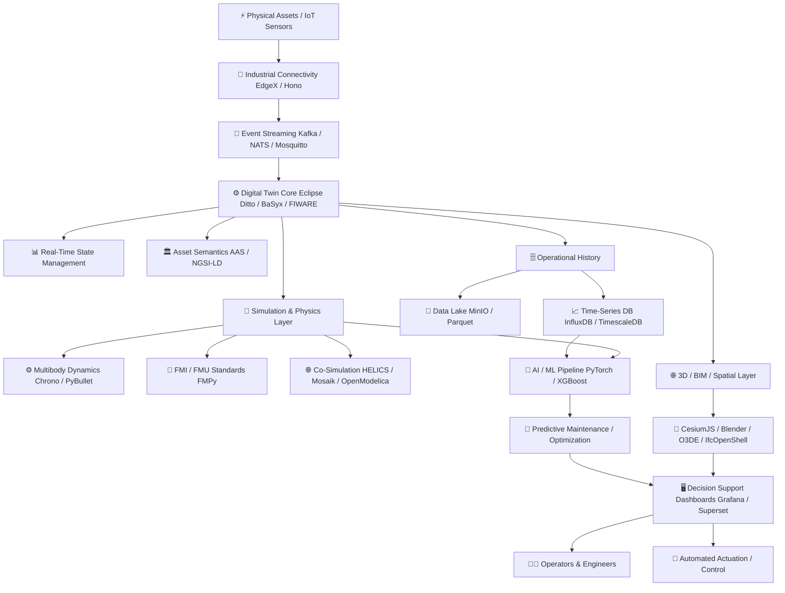

  
  
  
  

  

# ⚡ Awesome Simulation & Digital Twin Platform 🚀

> **The definitive curated directory of commercial SaaS digital twin platforms, open-source simulation tools, IoT context brokers, physics engines, spatial 3D frameworks, and enterprise digital twin technology stacks.**

**Last Updated:** September 2026 | **Keywords:** `digital-twin`, `physics-simulation`, `industrial-iot`, `asset-administration-shell`, `co-simulation`, `fmi-fmu`, `openmodelica`, `cesiumjs`, `eclipse-ditto`, `smart-cities`, `predictive-maintenance`

---

## 📌 Introduction

Digital Twin and Simulation platforms combine **physics-based simulation, real-time IoT data, engineering models, operational data, AI/ML, 3D visualization and lifecycle information** to create a continuously updated digital representation of a physical asset, machine, process, facility, vehicle, infrastructure system or entire industrial environment.

Leading commercial platforms include:
* 🌐 [Amazon AWS IoT TwinMaker](https://aws.amazon.com/iot-twinmaker/)
* ☁️ [Microsoft Azure Digital Twins](https://azure.microsoft.com/products/digital-twins)
* 🎮 [NVIDIA Omniverse](https://www.nvidia.com/en-us/omniverse/)
* ⚙️ [Siemens Simcenter](https://plm.sw.siemens.com/en-US/simcenter/)
* 🏢 [IBM Maximo Application Suite](https://www.ibm.com/products/maximo)
* ⚡ [Schneider Electric EcoStruxure](https://www.se.com/ww/en/work/solutions/ecostruxure/)
* 📐 [Dassault Systèmes 3DEXPERIENCE](https://www.3ds.com/3dexperience)
* 🏗️ [Hexagon Nexus](https://nexus.hexagon.com/)
* 🔬 [Ansys Twin Builder](https://www.ansys.com/products/digital-twin/ansys-twin-builder)
* 🏭 [PTC ThingWorx](https://www.ptc.com/en/products/thingworx)

These platforms differ significantly. Some are primarily **engineering simulation environments**, some are **IoT/digital-twin platforms**, while others concentrate on **industrial data historians, BIM/geospatial twins or enterprise asset intelligence**.

---

## 📊 Examples of Digital Twin Applications 💡

Digital Twin platforms can be used across numerous domains:
* 🏭 **Manufacturing & Factory Twins:** Real-time production monitoring, robot cell simulation, shop-floor optimization.
* ⚡ **Energy & Power Systems:** Grid load balance, turbine health monitoring, solar asset performance.
* 🚗 **Automotive & Aerospace:** Vehicle dynamics, autonomous fleet simulation, aerodynamic modeling.
* 🏢 **Smart Buildings & Infrastructure:** HVAC energy efficiency, structural health monitoring, BIM synchronization.
* 🌆 **Smart Cities & Geospatial:** Traffic flow optimization, urban microclimate simulation, utility management.
* 🤖 **Robotics & Autonomous Systems:** Virtual commissioning, reinforcement learning in synthetic environments.
* 🔮 **Predictive Maintenance:** Remaining useful life (RUL) estimation, fault detection, hybrid physics-AI analytics.

---

## 📖 Table of Contents 📑

* ☁️ [SaaS / Hosted Platforms](#-saas--hosted-platforms)
* ⭐ [Open-Source Repositories Ranked by GitHub Stars](#-open-source-repositories-ranked-by-github-stars)
* 🏗️ [Open-Source Digital Twin Platforms](#-open-source-digital-twin-platforms)
* ⚙️ [Open-Source Simulation & Co-Simulation](#-open-source-simulation--co-simulation)
* 📡 [Open-Source IoT & Edge Platforms](#-open-source-iot--edge-platforms)
* 🌐 [Open-Source 3D, BIM & Spatial Twin Technologies](#-open-source-3d-bim--spatial-twin-technologies)
* 🗄️ [Open-Source Data & Time-Series Infrastructure](#-open-source-data--time-series-infrastructure)
* 🧠 [Open-Source AI/ML for Digital Twins](#-open-source-aiml-for-digital-twins)
* 🔄 [Commercial Platform → Open-Source Equivalents](#-commercial-platform--open-source-equivalents)
* 🏛️ [Frameworks for Building Custom Digital Twin Systems](#-frameworks-for-building-custom-digital-twin-systems)
* 📐 [Reference Architecture](#-reference-architecture)
* 🔄 [Digital Twin Lifecycle](#-digital-twin-lifecycle)
* 📈 [Star History](#-star-history)
* 🤝 [How to Contribute](#-how-to-contribute)
* ⚠️ [Disclaimer](#-disclaimer)

---

## ☁️ SaaS / Hosted Platforms

> 💡 **Market Overview & Industry Structure:**
> The global Digital Twin & Industrial Simulation market size was estimated at **~$13.2 Billion in 2024** and is projected to reach **~$110 Billion by 2032** (CAGR of ~30.5%). The sector is **moderately fragmented**, dominated by enterprise engineering software vendors (*Ansys/Synopsys, Siemens, Dassault Systèmes, PTC, Bentley*) alongside hyperscale cloud providers (*AWS, Microsoft Azure, NVIDIA*). It remains a non-winner-take-all market due to specialized physics domains and fragmented industrial verticals.

The table below summarizes commercial and hosted Digital Twin platforms, sorted by **Company Size (Revenue / Market Capitalization)** in descending order:

| Platform | Primary Focus | Typical Use | Pricing | Free Tier / Trial Limits | Company Size (Revenue / Valuation) 📊 |
| --- | --- | --- | --- | --- | --- |
| [AWS IoT TwinMaker](https://aws.amazon.com/iot-twinmaker/) | IoT + 3D + operational data | Industrial/operational twins | Starts at $0.02 per 1,000 Data Access API calls after free tier | Free tier includes 50 million Data Access API calls/month for first 12 months | **~$575 Billion** Rev / ~$1.9T Market Cap (Amazon) |
| [Azure Digital Twins](https://azure.microsoft.com/products/digital-twins) | Cloud twin graph + IoT | Buildings, facilities, industrial assets | Starts at $0.003 per 1,000 Digital Twin operations + $0.001 per 1,000 Query Units | 30-day free trial with $200 Azure credits via Azure Free Account | **~$245 Billion** Rev / ~$3.1T Market Cap (Microsoft) |
| [NVIDIA Omniverse](https://www.nvidia.com/en-us/omniverse/) | 3D simulation + industrial metaverse | Robotics, factories, synthetic environments | Free ($0/month) for individual developers; Enterprise support starts at $4,500/year per GPU | Free forever plan for individual creators/developers; 30-day trial for Enterprise | **~$120 Billion** Rev / ~$3.0T Market Cap (NVIDIA) |
| [Siemens Simcenter](https://plm.sw.siemens.com/en-US/simcenter/) | CAE + system simulation + test | Engineering & industrial simulation | Starts at ~$300/month (~$3,500/year) for Simcenter Cloud HPC starter tier | 30-day free trial for Simcenter Cloud HPC (includes 500 free compute credits) | **~$84 Billion** Rev / ~$140B Market Cap (Siemens) |
| [IBM Maximo Application Suite](https://www.ibm.com/products/maximo) | Asset management + analytics | Asset performance | Essentials SaaS tier starts at ~$3,150/month (~$125/user/month AppPoints) | 14-day free trial of Maximo SaaS with sample asset data | **~$62 Billion** Rev / ~$180B Market Cap (IBM) |
| [Schneider Electric EcoStruxure](https://www.se.com/ww/en/work/solutions/ecostruxure/) | Energy + industrial IoT | Industrial/building twins | Starts at ~$50/monitored device/year (~$250/month base IT Expert subscription) | 30-day free trial for EcoStruxure IT Expert (monitors up to 50 SNMP devices) | **~$38 Billion** Rev / ~$130B Market Cap (Schneider Electric) |
| [Dassault Systèmes 3DEXPERIENCE](https://www.3ds.com/3dexperience) | PLM + simulation + 3D experience | Product & lifecycle twins | Starts at ~$250/user/month (~$3,000/user/year) for Cloud Standard roles | 14-day free trial with full platform feature access | **~$6.5 Billion** Rev / ~$45B Market Cap (Dassault Systèmes) |
| [Dassault SIMULIA](https://www.3ds.com/products/simulia) | Multiphysics simulation | Engineering | Starts at ~$350/month (~$4,000/year) per user simulation role / token package | 30-day free evaluation via 3DEXPERIENCE Cloud; Abaqus Learning Edition free forever (max 1,000 nodes) | **~$6.5 Billion** Rev / ~$45B Market Cap (Dassault Systèmes) |
| [Hexagon Nexus](https://nexus.hexagon.com/) | Manufacturing engineering ecosystem | Connected manufacturing | Starts at ~$150/month (~$1,800/year) per user application role / compute credits | Free registration with 30-day free trial for individual cloud apps (e.g. Adams Car on Demand) | **~$5.7 Billion** Rev / ~$30B Market Cap (Hexagon) |
| [Ansys Twin Builder](https://www.ansys.com/products/digital-twin/ansys-twin-builder) | Physics + reduced-order models + hybrid analytics | Engineering digital twins | Starts at ~$1,500/month (~$18,000/year) per user node license | 30-day free trial (upon request); Free Student Edition (limited to 512k cells for academic use) | **~$2.3 Billion** Rev / ~$35B Valuation (Acquired by Synopsys) |
| [PTC ThingWorx](https://www.ptc.com/en/products/thingworx) | Industrial IoT + applications | Manufacturing & IIoT | Starts at ~$1,000/user/month (~$12,000/year) or ~$50,000/year base Foundation license | 30-day hosted developer evaluation / 90-day academic evaluation license | **~$2.2 Billion** Rev / ~$21B Market Cap (PTC) |
| [PTC Vuforia](https://www.ptc.com/en/products/vuforia) | AR + industrial visualization | Assisted operations | Basic Plan is $0/month; Premium Plan starts at ~$42/month (~$500/year) | Free forever Basic Plan (supports standard targets & 1,000 cloud recognitions/month) | **~$2.2 Billion** Rev / ~$21B Market Cap (PTC) |
| [AVEVA PI System](https://www.aveva.com/en/products/aveva-pi-system/) | Industrial historian + operational data | Process industries | Starts at ~$1,000/month (~$12,000/year) via CONNECT / AVEVA Flex subscription | 45-day free trial via CONNECT Data Services (includes up to 1,000 active streams) | **~$1.5 Billion** Rev / ~$12B Valuation (AVEVA Group) |
| [MathWorks Simulink](https://www.mathworks.com/products/simulink.html) | Dynamic system simulation | Controls & model-based design | Starts at $55/month ($540/year) standard individual license subscription | 30-day free trial with MATLAB/Simulink Online access; MATLAB Online Basic offers 20 hrs/mo free | **~$1.3 Billion** Rev / ~$15B Valuation (MathWorks Private) |
| [Bentley iTwin](https://www.bentley.com/software/itwin/) | Infrastructure digital twins | Civil infrastructure, BIM | Standard Subscription starts at $199/month (includes 200 credits/mo, 50 GB storage) | Free forever Community Subscription (100 credits/mo, 10 GB cloud data, 100 GB reality storage) | **~$1.2 Billion** Rev / ~$15B Market Cap (Bentley Systems) |
| [Altair Twin Activate](https://altair.com/twin-activate) | System simulation + reduced-order models | Engineering twins | Starts at ~$150/month (~$1,800/year) via Altair Units starter package | 30-day free trial via Altair One Marketplace; Free Student Edition (valid 1 yr, max 50 components) | **~$620 Million** Rev / ~$10B Valuation (Acquired by Siemens) |
| [C3 AI Digital Twins](https://c3.ai/products/digital-twins/) | AI + enterprise digital twins | Asset intelligence | Starts at $0.55/vCPU-hour (~$2,500/month base platform fee) or ~$250,000 pilot | 14-day free trial of C3 AI Studio with $500 cloud compute credits | **~$310 Million** Rev / ~$3.5B Market Cap (C3.ai) |
| [COMSOL Multiphysics](https://www.comsol.com/) | Multiphysics simulation | Physics-based twins | Starts at ~$1,600/year annual single-user term license (~$3,995 perpetual base) | 14-day temporary evaluation license upon sales representative approval | **~$150 Million** Rev / ~$1.5B Valuation (COMSOL Private) |

---

## ⭐ Open-Source Repositories Ranked by GitHub Stars

Below is the master list of key open-source building blocks for Digital Twins and Simulation, sorted strictly by **GitHub Star Count (Descending)**:

| Rank | Project Name | Category | GitHub Stars ⭐ | Stargazers Link 🔗 |
| --- | --- | --- | --- | --- |
| 1 | [TensorFlow](https://github.com/tensorflow/tensorflow) | AI / Machine Learning |  | [Stargazers](https://github.com/tensorflow/tensorflow/stargazers) |
| 2 | [PyTorch](https://github.com/pytorch/pytorch) | AI / Machine Learning |  | [Stargazers](https://github.com/pytorch/pytorch/stargazers) |
| 3 | [Grafana](https://github.com/grafana/grafana) | Visualization & Dashboards |  | [Stargazers](https://github.com/grafana/grafana/stargazers) |
| 4 | [Apache Superset](https://github.com/apache/superset) | Visualization & Analytics |  | [Stargazers](https://github.com/apache/superset/stargazers) |
| 5 | [scikit-learn](https://github.com/scikit-learn/scikit-learn) | AI / Machine Learning |  | [Stargazers](https://github.com/scikit-learn/scikit-learn/stargazers) |
| 6 | [MinIO](https://github.com/minio/minio) | Object Storage |  | [Stargazers](https://github.com/minio/minio/stargazers) |
| 7 | [ClickHouse](https://github.com/ClickHouse/ClickHouse) | Columnar Data Infrastructure |  | [Stargazers](https://github.com/ClickHouse/ClickHouse/stargazers) |
| 8 | [Metabase](https://github.com/metabase/metabase) | BI & Visualization |  | [Stargazers](https://github.com/metabase/metabase/stargazers) |
| 9 | [Apache Spark](https://github.com/apache/spark) | Data Analytics Engine |  | [Stargazers](https://github.com/apache/spark/stargazers) |
| 10 | [DuckDB](https://github.com/duckdb/duckdb) | Analytical Database |  | [Stargazers](https://github.com/duckdb/duckdb/stargazers) |
| 11 | [Apache Kafka](https://github.com/apache/kafka) | Event Streaming |  | [Stargazers](https://github.com/apache/kafka/stargazers) |
| 12 | [InfluxDB](https://github.com/influxdata/influxdb) | Time-Series Database |  | [Stargazers](https://github.com/influxdata/influxdb/stargazers) |
| 13 | [XGBoost](https://github.com/dmlc/xgboost) | Machine Learning |  | [Stargazers](https://github.com/dmlc/xgboost/stargazers) |
| 14 | [MLflow](https://github.com/mlflow/mlflow) | ML Lifecycle |  | [Stargazers](https://github.com/mlflow/mlflow/stargazers) |
| 15 | [Apache Flink](https://github.com/apache/flink) | Stream Processing |  | [Stargazers](https://github.com/apache/flink/stargazers) |
| 16 | [Node-RED](https://github.com/node-red/node-red) | Flow-Based Integration |  | [Stargazers](https://github.com/node-red/node-red/stargazers) |
| 17 | [TimescaleDB](https://github.com/timescale/timescaledb) | Time-Series Database |  | [Stargazers](https://github.com/timescale/timescaledb/stargazers) |
| 18 | [ThingsBoard](https://github.com/thingsboard/thingsboard) | IoT & Twin Operational Layer |  | [Stargazers](https://github.com/thingsboard/thingsboard/stargazers) |
| 19 | [PostgreSQL](https://github.com/postgres/postgres) | Relational Database |  | [Stargazers](https://github.com/postgres/postgres/stargazers) |
| 20 | [NATS Server](https://github.com/nats-io/nats-server) | Cloud Messaging |  | [Stargazers](https://github.com/nats-io/nats-server/stargazers) |
| 21 | [Blender](https://github.com/blender/blender) | 3D Modeling & Visualization |  | [Stargazers](https://github.com/blender/blender/stargazers) |
| 22 | [LightGBM](https://github.com/microsoft/LightGBM) | Machine Learning |  | [Stargazers](https://github.com/microsoft/LightGBM/stargazers) |
| 23 | [CesiumJS](https://github.com/CesiumGS/cesium) | 3D Geospatial Engine |  | [Stargazers](https://github.com/CesiumGS/cesium/stargazers) |
| 24 | [PyBullet](https://github.com/bulletphysics/bullet3) | Physics & Robotics |  | [Stargazers](https://github.com/bulletphysics/bullet3/stargazers) |
| 25 | [CARLA Simulator](https://github.com/carla-simulator/carla) | Autonomous Driving Simulator |  | [Stargazers](https://github.com/carla-simulator/carla/stargazers) |
| 26 | [OpenLayers](https://github.com/openlayers/openlayers) | 2D/3D Mapping |  | [Stargazers](https://github.com/openlayers/openlayers/stargazers) |
| 27 | [Eclipse Mosquitto](https://github.com/eclipse-mosquitto/mosquitto) | MQTT Broker |  | [Stargazers](https://github.com/eclipse-mosquitto/mosquitto/stargazers) |
| 28 | [PyOD](https://github.com/yzhao062/pyod) | Anomaly Detection |  | [Stargazers](https://github.com/yzhao062/pyod/stargazers) |
| 29 | [O3DE](https://github.com/o3de/o3de) | 3D Industrial Simulation Engine |  | [Stargazers](https://github.com/o3de/o3de/stargazers) |
| 30 | [Webots](https://github.com/cyberbotics/webots) | Robot Simulator |  | [Stargazers](https://github.com/cyberbotics/webots/stargazers) |
| 31 | [Eclipse SUMO](https://github.com/eclipse-sumo/sumo) | Urban Traffic Simulator |  | [Stargazers](https://github.com/eclipse-sumo/sumo/stargazers) |
| 32 | [Project Chrono](https://github.com/projectchrono/chrono) | Physics Multibody Dynamics |  | [Stargazers](https://github.com/projectchrono/chrono/stargazers) |
| 33 | [IfcOpenShell](https://github.com/IfcOpenShell/IfcOpenShell) | BIM / IFC Processing |  | [Stargazers](https://github.com/IfcOpenShell/IfcOpenShell/stargazers) |
| 34 | [Magistrala (Mainflux)](https://github.com/absmach/magistrala) | IoT Platform |  | [Stargazers](https://github.com/absmach/magistrala/stargazers) |
| 35 | [OpenFOAM](https://github.com/OpenFOAM/OpenFOAM-dev) | CFD Fluid Simulation |  | [Stargazers](https://github.com/OpenFOAM/OpenFOAM-dev/stargazers) |
| 36 | [EnergyPlus](https://github.com/NREL/EnergyPlus) | Building Energy Simulator |  | [Stargazers](https://github.com/NREL/EnergyPlus/stargazers) |
| 37 | [EdgeX Foundry](https://github.com/edgexfoundry/edgex-go) | IIoT Edge Platform |  | [Stargazers](https://github.com/edgexfoundry/edgex-go/stargazers) |
| 38 | [Gazebo](https://github.com/gazebosim/gz-sim) | Robotics Simulator |  | [Stargazers](https://github.com/gazebosim/gz-sim/stargazers) |
| 39 | [OpenModelica](https://github.com/OpenModelica/OpenModelica) | System Simulation Engine |  | [Stargazers](https://github.com/OpenModelica/OpenModelica/stargazers) |
| 40 | [Eclipse Ditto](https://github.com/eclipse-ditto/ditto) | Digital Twin Core |  | [Stargazers](https://github.com/eclipse-ditto/ditto/stargazers) |
| 41 | [FMPy](https://github.com/CATIA-Systems/FMPy) | FMI/FMU Simulation |  | [Stargazers](https://github.com/CATIA-Systems/FMPy/stargazers) |
| 42 | [Eclipse Hono](https://github.com/eclipse-hono/hono) | IoT Connectivity |  | [Stargazers](https://github.com/eclipse-hono/hono/stargazers) |
| 43 | [OpenTwins](https://github.com/ertis-research/opentwins) | Compositional Digital Twin |  | [Stargazers](https://github.com/ertis-research/opentwins/stargazers) |
| 44 | [HELICS](https://github.com/GMLC-TDC/HELICS) | Co-Simulation Framework |  | [Stargazers](https://github.com/GMLC-TDC/HELICS/stargazers) |
| 45 | [FIWARE Orion-LD](https://github.com/FIWARE/context.Orion-LD) | NGSI-LD Context Broker |  | [Stargazers](https://github.com/FIWARE/context.Orion-LD/stargazers) |
| 46 | [SimPy](https://github.com/simpx/simpy) | Discrete-Event Simulation |  | [Stargazers](https://github.com/simpx/simpy/stargazers) |
| 47 | [Eclipse BaSyx](https://github.com/eclipse-basyx/basyx-java-sdk) | Asset Administration Shell |  | [Stargazers](https://github.com/eclipse-basyx/basyx-java-sdk/stargazers) |
| 48 | [Mosaik](https://github.com/OFFIS-mosaik/mosaik) | Smart Grid Co-Simulation |  | [Stargazers](https://github.com/OFFIS-mosaik/mosaik/stargazers) |

---

## 🏗️ Open-Source Digital Twin Platforms

The projects below provide core state abstraction, context brokers, and Industry 4.0 Asset Administration Shell (AAS) semantic layers for Digital Twins:

### 1. [ThingsBoard](https://github.com/thingsboard/thingsboard) 
* **License:** Apache-2.0 | **Primary Focus:** Operational Digital Twin & IoT Dashboard Infrastructure
* **Features:** Device management, entity relationships, telemetry data pipelines, real-time dashboards, rule chains, SCADA visualization, and edge gateways.

### 2. [Magistrala (Mainflux)](https://github.com/absmach/magistrala) 
* **License:** Apache-2.0 | **Primary Focus:** IIoT Messaging & Device Twin Management
* **Features:** Multi-protocol IoT messaging (MQTT, HTTP, WebSocket, CoAP), fine-grained access control, Kubernetes deployment, data routing.

### 3. [Eclipse Ditto](https://github.com/eclipse-ditto/ditto) 
* **License:** EPL-2.0 | **Primary Focus:** Digital Twin State Abstraction & Device-as-a-Service
* **Features:** Desired vs. reported state synchronization, access control policies, WebSocket/REST/Kafka integration, horizontal scalability on Kubernetes.

### 4. [OpenTwins](https://github.com/ertis-research/opentwins) 
* **License:** Open Source | **Primary Focus:** Compositional Digital Twin Architecture
* **Features:** Assembles Eclipse Ditto, Eclipse Hono, Apache Kafka, InfluxDB, and Grafana into a unified Digital Twin operational stack.

### 5. [FIWARE Orion-LD](https://github.com/FIWARE/context.Orion-LD) 
* **License:** EPL-2.0 | **Primary Focus:** Smart Cities & NGSI-LD Context Management
* **Features:** NGSI-LD / NGSI-v2 context broker, temporal graph representations, entity relationships, real-time spatial context updates.

### 6. [Eclipse BaSyx](https://github.com/eclipse-basyx/basyx-java-sdk) 
* **License:** EPL-2.0 | **Primary Focus:** Industry 4.0 Asset Administration Shell (AAS)
* **Features:** AAS submodels, OPC UA integration, Industry 4.0 semantics, multi-language SDKs (Java, Python, C++, Go, .NET, Rust).

---

## ⚙️ Open-Source Simulation & Co-Simulation

These projects reproduce the physics modeling and dynamic simulation capabilities of commercial tools like *Ansys Twin Builder, Simcenter, Altair Twin Activate, and Simulink*:

### 1. [PyBullet](https://github.com/bulletphysics/bullet3) 
* **License:** zlib | **Primary Focus:** Real-Time Physics & Multibody Simulation
* **Features:** Rigid body dynamics, collision detection, robotics simulation, PyBullet Python API, reinforcement learning environments.

### 2. [CARLA Simulator](https://github.com/carla-simulator/carla) 
* **License:** MIT | **Primary Focus:** Autonomous Driving & Vehicle Simulation
* **Features:** Urban layout generation, sensor suites (LIDAR, cameras, RADAR), dynamic weather, traffic simulation, ROS integration.

### 3. [Webots](https://github.com/cyberbotics/webots) 
* **License:** Apache-2.0 | **Primary Focus:** Robotics & Virtual Commissioning
* **Features:** 3D robot modeling, physics engine, sensor/actuator simulation, Python/C++/ROS API, virtual hardware testing.

### 4. [Eclipse SUMO](https://github.com/eclipse-sumo/sumo) 
* **License:** EPL-2.0 | **Primary Focus:** Urban Traffic & Mobility Simulation
* **Features:** Microscopic traffic flow simulation, vehicle routing, signal control, multimodal traffic, TraCI API.

### 5. [Project Chrono](https://github.com/projectchrono/chrono) 
* **License:** BSD-3-Clause | **Primary Focus:** Multibody Dynamics & Physics Engine
* **Features:** Vehicle dynamics, terramechanics, FEA structural simulation, granular material simulation, parallel GPU acceleration.

### 6. [OpenFOAM](https://github.com/OpenFOAM/OpenFOAM-dev) 
* **License:** GPL-3.0 | **Primary Focus:** Computational Fluid Dynamics (CFD)
* **Features:** Fluid flow simulation, heat transfer, chemical reactions, multiphase flows, turbulence modeling.

### 7. [EnergyPlus](https://github.com/NREL/EnergyPlus) 
* **License:** Custom Open Source | **Primary Focus:** Building Energy & HVAC Simulation
* **Features:** Building energy consumption, thermal load analysis, HVAC system simulation, renewable energy integration.

### 8. [Gazebo](https://github.com/gazebosim/gz-sim) 
* **License:** Apache-2.0 | **Primary Focus:** Autonomous Robot Digital Twins
* **Features:** High-fidelity physics, sensor generation, ROS 2 integration, virtual environment testing.

### 9. [OpenModelica](https://github.com/OpenModelica/OpenModelica) 
* **License:** OSMC-PL | **Primary Focus:** Modelica-Based System Modeling
* **Features:** Acausal physical modeling, OMEdit graphical modeling, FMI export/import, OMSimulator co-simulation engine.

### 10. [FMPy](https://github.com/CATIA-Systems/FMPy) 
* **License:** BSD-2-Clause | **Primary Focus:** FMI / FMU Co-Simulation Execution
* **Features:** FMI 1.0/2.0/3.0 support, Model Exchange, Co-Simulation, web application GUI, Jupyter notebook integration.

### 11. [HELICS](https://github.com/GMLC-TDC/HELICS) 
* **License:** BSD-3-Clause | **Primary Focus:** Large-Scale Co-Simulation Framework
* **Features:** Interoperability for energy systems, time synchronization across heterogeneous simulators, C++/Python/Java APIs.

### 12. [SimPy](https://github.com/simpx/simpy) 
* **License:** MIT | **Primary Focus:** Discrete-Event Simulation Framework
* **Features:** Process-based discrete event modeling, queuing system simulation, resource management, Python generators.

### 13. [Mosaik](https://github.com/OFFIS-mosaik/mosaik) 
* **License:** LGPL-2.1 | **Primary Focus:** Smart Grid Co-Simulation Orchestration
* **Features:** Multi-simulator composition, scenario creation, time step synchronization across distributed models.

---

## 📡 Open-Source IoT & Edge Platforms

Connectivity platforms for streaming industrial sensor telemetry into Digital Twin models:

* 🟢 **[Node-RED](https://github.com/node-red/node-red)**  — Low-code flow-based programming for IoT data routing and protocol translation.
* 🟢 **[NATS Server](https://github.com/nats-io/nats-server)**  — High-performance cloud-native messaging system for real-time telemetry.
* 🟢 **[Eclipse Mosquitto](https://github.com/eclipse-mosquitto/mosquitto)**  — Lightweight MQTT message broker for edge device telemetry.
* 🟢 **[EdgeX Foundry](https://github.com/edgexfoundry/edgex-go)**  — Vendor-neutral IIoT edge software framework supporting Modbus, OPC UA, and MQTT.
* 🟢 **[Eclipse Hono](https://github.com/eclipse-hono/hono)**  — Scalable microservice infrastructure for connecting millions of IoT devices.

---

## 🌐 Open-Source 3D, BIM & Spatial Twin Technologies

Spatial visualizers and 3D graphic engines for building virtual industrial environments:

* 🎨 **[Blender](https://github.com/blender/blender)**  — 3D modeling pipeline for creating CAD assets and digital twin visualization meshes.
* 🌍 **[CesiumJS](https://github.com/CesiumGS/cesium)**  — 3D WebGL globe and map visualization for geospatial & smart city digital twins.
* 🗺️ **[OpenLayers](https://github.com/openlayers/openlayers)**  — High-performance dynamic web map engine for 2D/3D spatial context.
* 🎮 **[Open 3D Engine (O3DE)](https://github.com/o3de/o3de)**  — Apache 2.0 multi-platform 3D engine for high-fidelity industrial metaverses.
* 🏛️ **[IfcOpenShell](https://github.com/IfcOpenShell/IfcOpenShell)**  — Open-source IFC/BIM processing library for building & infrastructure digital twins.
* 🗺️ **[OpenStreetMap](https://github.com/openstreetmap/openstreetmap-website)**  — Community-driven geospatial map data source for city-scale digital twins.

---

## 🗄️ Open-Source Data & Time-Series Infrastructure

High-throughput databases and event streams for persistent telemetry storage:

* ⚡ **[ClickHouse](https://github.com/ClickHouse/ClickHouse)**  — Real-time columnar analytical database for massive industrial telemetry logs.
* ⚡ **[Apache Spark](https://github.com/apache/spark)**  — Unified analytics engine for large-scale historical simulation data processing.
* ⚡ **[DuckDB](https://github.com/duckdb/duckdb)**  — In-process analytical SQL database engine ideal for local digital twin analytics.
* ⚡ **[Apache Kafka](https://github.com/apache/kafka)**  — Distributed event-streaming platform for real-time digital twin synchronization.
* ⚡ **[InfluxDB](https://github.com/influxdata/influxdb)**  — Purpose-built time-series database for high-frequency sensor measurements.
* ⚡ **[TimescaleDB](https://github.com/timescale/timescaledb)**  — PostgreSQL-based time-series database with full SQL support.
* ⚡ **[PostgreSQL](https://github.com/postgres/postgres)**  — Advanced relational database system (with PostGIS for spatial data).
* ⚡ **[MinIO](https://github.com/minio/minio)**  — High-performance S3-compatible object storage for CAD models, FMUs, and simulation outputs.

---

## 🧠 Open-Source AI/ML for Digital Twins

Machine learning libraries for surrogate modeling, remaining useful life (RUL) estimation, and anomaly detection:

* 🤖 **[TensorFlow](https://github.com/tensorflow/tensorflow)**  — End-to-end ML platform for predictive digital twin analytics.
* 🤖 **[PyTorch](https://github.com/pytorch/pytorch)**  — Deep learning framework widely used for physics-informed neural networks (PINNs).
* 🤖 **[scikit-learn](https://github.com/scikit-learn/scikit-learn)**  — Machine learning library for fault classification, regression, and clustering.
* 🤖 **[LightGBM](https://github.com/microsoft/LightGBM)**  — Gradient boosting framework for fast tabular sensor data prediction.
* 🤖 **[XGBoost](https://github.com/dmlc/xgboost)**  — Optimized gradient boosting library for asset health and RUL modeling.
* 🤖 **[MLflow](https://github.com/mlflow/mlflow)**  — Open source platform for managing the ML lifecycle in digital twin pipelines.
* 🤖 **[PyOD](https://github.com/yzhao062/pyod)**  — Comprehensive Python toolkit for detecting anomalies in industrial sensor telemetry.

---

## 🔄 Commercial Platform → Open-Source Equivalents

| Commercial Platform | Main Capability | Recommended Open-Source Equivalent Stack |
| --- | --- | --- |
| **Ansys Twin Builder** | Physics + system simulation + reduced-order models | OpenModelica + FMPy + HELICS + PyBullet + PyTorch |
| **Siemens Simcenter** | CAE + system simulation + dynamics | OpenModelica + FMPy + OpenFOAM + Project Chrono |
| **3DEXPERIENCE** | PLM + simulation + 3D rendering | OpenModelica + IfcOpenShell + Blender + O3DE + CesiumJS |
| **Azure Digital Twins** | Twin graph + cloud IoT broker | Eclipse Ditto + FIWARE Orion-LD + ThingsBoard + Kafka |
| **AWS IoT TwinMaker** | IoT + 3D + operational data | Eclipse Ditto + Hono + Kafka + InfluxDB + CesiumJS |
| **PTC ThingWorx** | IIoT + application builder | ThingsBoard + EdgeX Foundry + Ditto + Node-RED |
| **Altair Twin Activate** | System modeling + dynamic simulation | OpenModelica + FMPy + HELICS + Mosaik |
| **C3 AI Digital Twins** | Enterprise AI asset intelligence | Ditto + FIWARE + PyTorch + XGBoost + MLflow |
| **AVEVA PI System** | Industrial historian & telemetry | InfluxDB + TimescaleDB + ClickHouse + Kafka + Grafana |
| **Bentley iTwin** | Infrastructure / BIM digital twins | IfcOpenShell + CesiumJS + Blender + OpenLayers |
| **NVIDIA Omniverse** | 3D simulation + synthetic environments | O3DE + Blender + CARLA + Gazebo + Webots |
| **Dassault SIMULIA** | Multiphysics & structural simulation | OpenModelica + Project Chrono + OpenFOAM |
| **MathWorks Simulink** | Dynamic system controls modeling | OpenModelica + FMPy + Python Scientific Stack |

---

## 🏛️ Frameworks for Building Custom Digital Twin Systems

A robust enterprise digital twin architecture is best constructed as a composable layered stack:

| Layer | Recommended Open-Source Technologies 🛠️ |
| --- | --- |
| **Physical Assets** | Industrial Sensors · PLCs · Autonomous Robots · Machines |
| **Edge Connectivity** | EdgeX Foundry · Eclipse Hono · OPC UA · Modbus |
| **Event Streaming** | Apache Kafka · Eclipse Mosquitto · NATS |
| **Digital Twin Core** | Eclipse Ditto · Eclipse BaSyx (AAS) · FIWARE Orion-LD |
| **Asset Semantics** | Asset Administration Shell (AAS) · NGSI-LD · OPC UA Models |
| **Time-Series Storage** | InfluxDB · TimescaleDB · ClickHouse |
| **Data Lake** | MinIO · Apache Iceberg · Parquet |
| **System Simulation** | OpenModelica · FMPy · HELICS · Mosaik |
| **Physics Simulation** | Project Chrono · OpenFOAM · PyBullet |
| **AI / Machine Learning** | PyTorch · XGBoost · scikit-learn · PyOD |
| **3D & Spatial Visualization** | CesiumJS · Blender · O3DE · OpenLayers |
| **BIM & Building Data** | IfcOpenShell · EnergyPlus |
| **Dashboards & BI** | Grafana · Apache Superset · Metabase |
| **Container Orchestration** | Docker · Kubernetes |

---

## 📐 Reference Architecture

---

## 🔄 Digital Twin Lifecycle

```mermaid
flowchart LR
    A[🏭 Physical Asset] --> B[📡 Telemetry Acquisition]
    B --> C[⚙️ Digital State Model]
    C --> D[🎯 Physics Calibration]
    D --> E[🔮 Simulation Execution]
    E --> F[✅ Model Validation]
    F --> G[🚀 Operational Twin]
    G --> H[📈 Real-Time Monitoring]
    H --> I[🧠 AI Failure Prediction]
    I --> J[⚡ Optimization Action]
    J --> K[🔄 Actuation & Control]
    K --> A
```

---

## 📈 Star History

---

## 🤝 How to Contribute

Contributions are welcome! You can contribute by:
* ➕ Adding new open-source Digital Twin projects or simulation tools.
* 📝 Improving documentation, tutorials, and real-world deployment examples.
* 🛠️ Updating license, pricing, or company size information.

Please see our [Awesome List Guidelines](https://github.com/ishandutta2007/Awesome-Awesome-Awesome) for submission details.

---

## ⚠️ Disclaimer

This repository is intended strictly as a **technology discovery and architectural comparison resource**. All product names, logos, and trademarks belong to their respective owners. Commercial pricing and valuation figures are estimated based on public business intelligence data and are subject to change.

---

  <b>Awesome Simulation &amp; Digital Twin Platform</b> is maintained by <a href="https://github.com/ishandutta2007">Ishan Dutta</a>.

